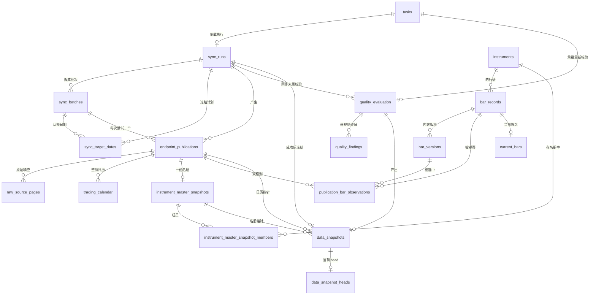
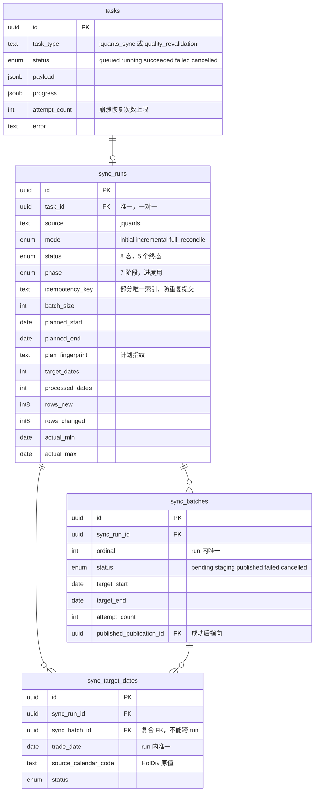
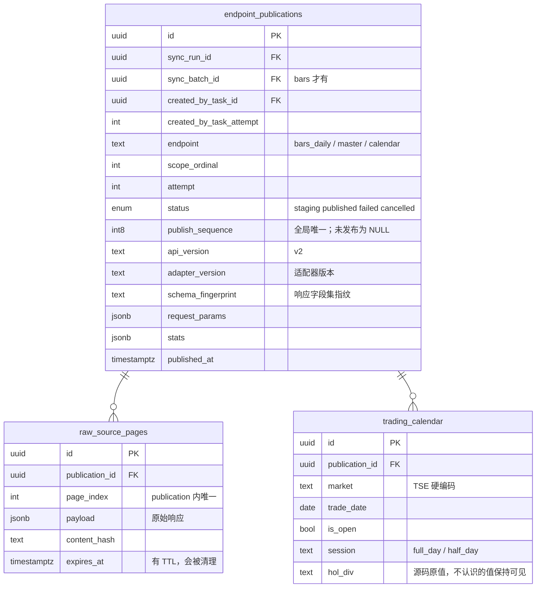
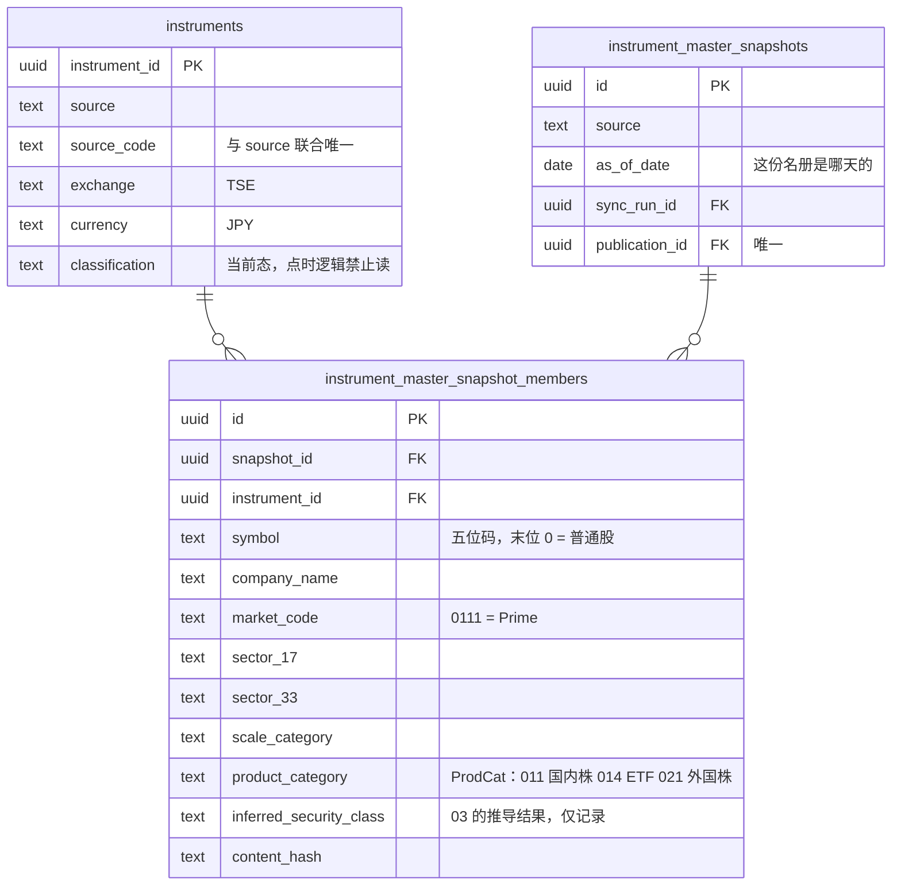
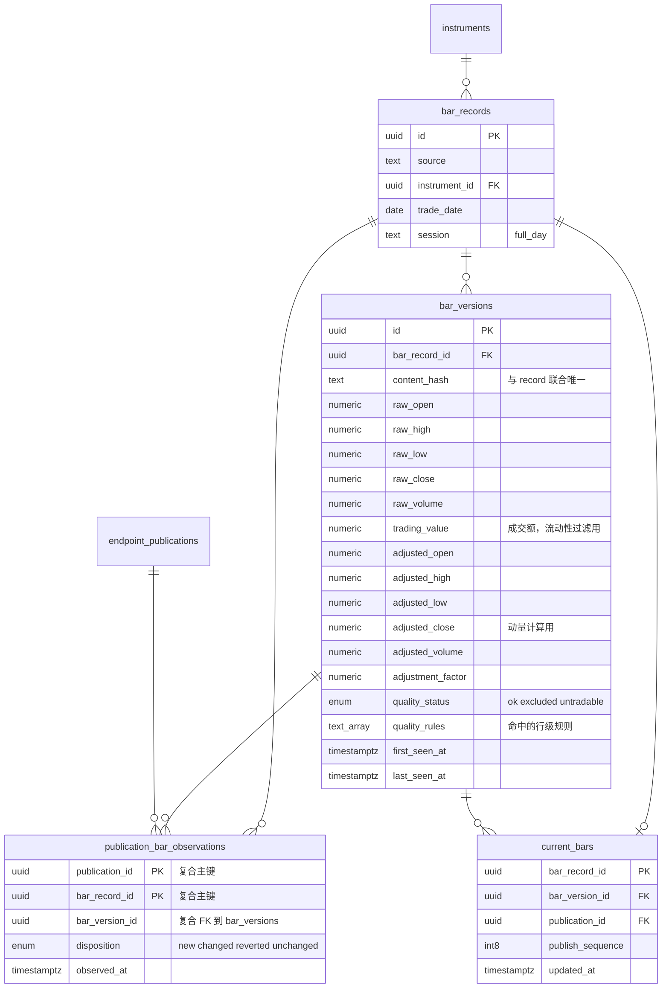
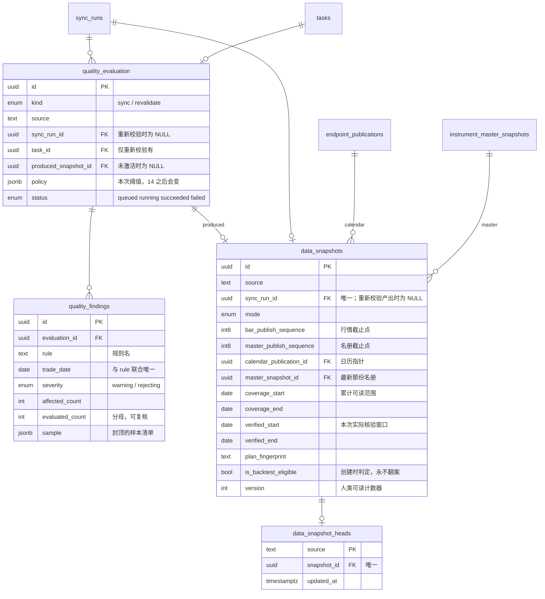

# 数据模型总览与 ER 图

- 状态：Descriptive（描述**已建成**的模型，不是提案）
- 日期：2026-08-23
- 覆盖：`backend/app/models/` 下的全部 18 张表，对应 ticket 01–05、16 已落地的部分
- 关联：[J-Quants 连续批次同步模型设计](./jquants-continuous-batch-sync.md)（这些表**为什么**长这样）、`docs/personal-investment-research-system-spec.md` §6、§11

本文回答「现在库里有什么、彼此怎么连」。设计动机不重复，需要时点到上面那篇的对应小节。

---

## 1. 三条贯穿全局的规则

**先读这一节。** 不知道这三条规则，下面的图会看成一堆莫名其妙的外键。

### 1.1 全局发布序号：可见性的唯一基准

`endpoint_publications.publish_sequence` 是一个跨所有端点、全局唯一的递增序号（PostgreSQL sequence `endpoint_publish_seq`）。它由一条约束守着：

```sql
CHECK (status = 'published' OR publish_sequence IS NULL)
```

即**没发布就没有序号**。于是"某个时刻的事实"可以只用一个整数表达——所有 `publish_sequence ≤ N` 且 `status = 'published'` 的数据。

这是整个点时体系的地基：`DataSnapshot` 因此不必复制任何一行行情，只存一个截止点。

### 1.2 内容与观察分离：A → B → A 不产生第三行

行情用三张表而不是一张：

| 表 | 语义 | 可变性 |
|---|---|---|
| `bar_records` | **身份**：哪只证券、哪一天 | 建了就不动 |
| `bar_versions` | **内容**：这组 OHLCV 数值 | 不可变，按 `content_hash` 去重 |
| `publication_bar_observations` | **观察**：某次发布看到的是哪个版本 | 追加，不改 |

数据源把一行改成 B 又改回 A 时，**复用最初那行 A 的 `bar_versions`**，只追加一条新的观察记录。好处是审计历史不被改写；代价是"当前版本"必须解析而不能直接读，这正是 §1.1 那个序号存在的原因。

关键细节：**每次返回的每一行都写观察记录，包括内容完全没变的**（`disposition = 'unchanged'`）。少写这一条，"这个快照看到的是哪个版本"就无法仅凭序号回答。

### 1.3 快照的三个截止点

`DataSnapshot` 一行里有三个互不相同的"冻结点"，各管一类数据：

| 列 | 管什么 | 为什么不能共用 |
|---|---|---|
| `bar_publish_sequence` | 行情版本可见性 | — |
| `master_publish_sequence` | 名册可见性 | 名册在**所有 K 线之后**发布，序号必然更大；用行情截止点筛名册会筛出**恒为空集** |
| `calendar_publication_id` | 交易日历 | 日历整份复制、按 publication 隔离，直接用指针即可，不需要第二套序号解析 |

第二条是 05 实现时被测试当场抓到的错误，不是理论推演。

---

## 2. 全景图

省略字段，只看谁连谁。四个域用颜色区分在心里：**同步过程**（灰）→ **发布**（枢纽）→ **事实数据**（行情/名册/日历）→ **判定与冻结**（质量/快照）。



`endpoint_publications` 是**唯一连接四个域的枢纽**：所有事实数据都挂在它下面，所有可见性判断都问它要序号。

---

## 3. 分域 ER 图

### 3.1 同步运行与冻结计划

一次"立即同步"产生一个 `SyncRun`，它拥有一份**在开始时就冻结、之后不再改变**的计划：哪些交易日要取、切成哪些批次。



两条值得注意的约束：

- `uq_sync_run_active_source` 是**部分唯一索引**（`status IN ('queued','running','cancelling')`），从数据库层面保证一个数据源同时只有一次同步在飞。
- `sync_target_dates` 用**复合外键**指向 `(sync_batches.id, sync_batches.sync_run_id)`，使一个目标日期在结构上不可能挂到别的 run 的批次上。

### 3.2 发布与原始响应

`EndpointPublication` 是"一次端点调用的一代结果"。`STAGING` 期间对所有读者不可见，只有 `PUBLISHED` 并拿到 `publish_sequence` 才成为正式事实。



日历**每次发布整份复制**（一年约 250 行，两年 731 行），不做行级版本。修订靠 publication 隔离：旧 publication 的行永不被触碰，于是引用旧 `calendar_publication_id` 的快照永远看到同一份日历。

`schema_fingerprint` 是响应字段集的哈希——数据源悄悄加字段或删字段时，它是唯一会变的东西。

### 3.3 标的与点时名册



**`Instrument.classification` 与 `InstrumentMasterSnapshotMember` 的区别是这里最容易踩的坑**：前者每次同步被覆盖写，是**当前态**；后者是某一天的**点时快照**。任何回溯历史的逻辑只能读后者。05 的股票池模块把这条写成了硬规矩。

名册按周回填：两年 107 份，每份约 4400 行，合计约 47 万行。为什么必须存历史名册而不能用今天的名单回溯——两年内曾为 Prime 普通股的证券共 1681 只，最后一周只剩 1562 只，只用最新名单会看不见 119 只（占真实投资域的 7.1%），而缺的恰是被收购退市那批。

`product_category` 是 05 补加的列，旧行为 NULL；**NULL 按"不合格"处理，不猜**。

### 3.4 行情三级模型

这是全库最大、也是唯一需要"解析"才能读的部分。



**身份键**：`bar_records` 上 `(source, instrument_id, trade_date, session)` 唯一。另有索引 `ix_bar_record_source_date_instrument (source, trade_date, instrument_id)`——**所有查询的过滤条件都必须下推到这张表走这个索引**，理由见 §5.2。

**解析规则**（`app/services/snapshot_reader.py` 是唯一实现，调用方不得自己拼）：

```sql
-- 每个 bar_record，取截止点以下最高发布序号的那次观察所选的版本
DISTINCT ON (bar_records.id) ...
WHERE endpoint_publications.status = 'published'
  AND endpoint_publications.publish_sequence <= :cutoff
ORDER BY bar_records.id, endpoint_publications.publish_sequence DESC
```

**`current_bars` 是投影，不是事实源。** 它回答"现在是什么"，用于数据中心页面；任何冻结的回测、任何点时计算都必须走 `DataSnapshot` + 上面那条解析，绝不读它。批次发布失败不改变 `current_bars`。

`quality_status` 只承载**行内**结论（这一行自己的数值有没有问题），所以 A→B→A 复用版本行时结论自动跟着走。需要上下文的规则（缺交易日、日历不一致）无法满足这个性质，落在 `quality_findings` 上。

### 3.5 质量判定与不可变快照



三个设计点：

- **`coverage_*` 与 `verified_*` 不是一回事**：前者是截止点上累计可读的全部范围，后者只是这次运行真正回源核对过的窗口。混为一谈是这个拆分要防的错误。
- **`is_backtest_eligible` 创建时判定，之后永不重算**。已经被回测绑定的快照，不能因为后来改了规则就被推翻——而"当时是否干净"只有当时才能判断。
- **findings 挂在 evaluation 而非 sync run 上**：重新校验没有 run 可挂，借用原 run 的 id 又会和那次运行已写的 findings 撞主键。

---

## 4. 全表清单

| # | 表 | 规模量级 | 写者 | 主要读者 |
|---|---|---|---|---|
| 1 | `tasks` | 数百 | API / worker | worker 轮询、数据中心 |
| 2 | `sync_runs` | 数百 | 同步 workflow | 数据中心 |
| 3 | `sync_batches` | 数千 | 同步 workflow | 进度展示 |
| 4 | `sync_target_dates` | 数千 | 计划冻结事务 | 断点续跑 |
| 5 | `endpoint_publications` | 数百 | 每次端点调用 | **一切可见性判断** |
| 6 | `raw_source_pages` | 数千（有 TTL） | 同步 | 排查、重放 |
| 7 | `trading_calendar` | 731 × 发布次数 | 计划冻结事务 | `CalendarPort` |
| 8 | `instruments` | 约 4400 | 名册同步 | 代码/名称查找 |
| 9 | `instrument_master_snapshots` | 107+ | 名册同步 | 点时名册解析 |
| 10 | `instrument_master_snapshot_members` | **约 47 万** | 名册同步 | 股票池三层判据 |
| 11 | `bar_records` | **约 210 万** | 批次发布 | 所有行情查询的过滤落点 |
| 12 | `bar_versions` | ≥ `bar_records` | 批次发布 | 价格、成交额、质量状态 |
| 13 | `publication_bar_observations` | **最大**，每次发布每行一条 | 批次发布 | 版本解析 |
| 14 | `current_bars` | = `bar_records` | 批次发布 | 仅"现在是什么" |
| 15 | `quality_evaluation` | 数十 | 质量 pass | 数据中心 |
| 16 | `quality_findings` | 数千 | 质量 pass | 快照详情页 |
| 17 | `data_snapshots` | 数个 | 快照激活事务 | **所有研究与回测的入口** |
| 18 | `data_snapshot_heads` | 每个 source 一行 | 快照激活事务 | 默认快照解析 |

规模数字来自 04/05 的真实同步：两年免费档、约 4400 只证券、487 个开市日。

---

## 5. 读取规则

### 5.1 事实源 vs 投影

| 要回答的问题 | 走哪条路 |
|---|---|
| 「2026-05-22 那天丰田收盘价多少」（**冻结、可复现**） | `DataSnapshot` → `snapshot_member_query` → `bar_versions` |
| 「现在最新的收盘价是多少」（展示用） | `current_bars` |
| 「那天它算不算 Prime 普通股」 | `instrument_master_snapshots`（点时那份）→ members |
| 「它现在算什么类别」 | `Instrument.classification` |
| 「那天开不开市」 | `trading_calendar` + 快照的 `calendar_publication_id` |

**左列问题绝不能用右列的答案回答**——每一行都是一次前视偏差或幸存者偏差。

### 5.2 查询计划纪律

`publication_bar_observations` 的解析用 `DISTINCT ON`，而它有个危险性质：**过滤条件放错层，规划器可以选择"每只证券重跑一次内层解析"**。

05 实测过后果：同一条查询、同一份数据，单独跑约 1 秒，全量测试中逾 20 分钟未返回——差别纯粹在规划器选了哪个计划（开发库有统计信息侥幸选对，刚灌完数据的测试库没有）。

因此三条硬规矩：

1. **日期与 `instrument_ids` 都下推到 `bar_records`**（走 `ix_bar_record_source_date_instrument`），不要过滤已解析的子查询。
2. **不要用 `LEFT JOIN` 到解析子查询**来表达"没有数据的证券"——在 Python 侧用清单补齐，只留内连接。
3. **聚合留在 SQL**，别把百万行拉进 Python（04 曾因此把 worker 连杀三次）。

这三条已写进 `snapshot_reader.py` 与 `stock_pool.py` 的 docstring，新的查询照抄。

---

## 6. 尚未建模的

按 ticket 顺序，下面这些实体在 spec §11 里已有定义，但**目前一张表都还没建**：

| 实体 | 归属 ticket | 备注 |
|---|---|---|
| `Signal` | 10 | 06 产出信号但**刻意不落表**——`(快照, 决策日, 策略版本, 参数)` 完全决定结果，可随时重算；10 的回测运行才是它的归属 |
| `Strategy` | — | 同上：策略注册表在**代码**里，数据库只在运行绑定时记参数与版本 |
| `FundamentalFact` | 13 | 财务摘要，需先验证点时语义 |
| `Feature` | 13 之后 | 特征存储，目前无需求 |
| `BacktestRun` | 10 | |
| `SimAccount` / `SimOrder` / `SimFill` / `SimPosition` / `PortfolioSnapshot` | 08 / 09 | |
| `ReplaySession` / `ReplayDecision` | 12 | |
| `RiskResult` | 07 | |
| `ResearchSeries` | 11 之后 | 参数试验分组，防数据窥探 |

**06 不新增任何表**，详见 [`.scratch/personal-investment-research-system/06-design-doc.md`](../../.scratch/personal-investment-research-system/06-design-doc.md) §3.1。
